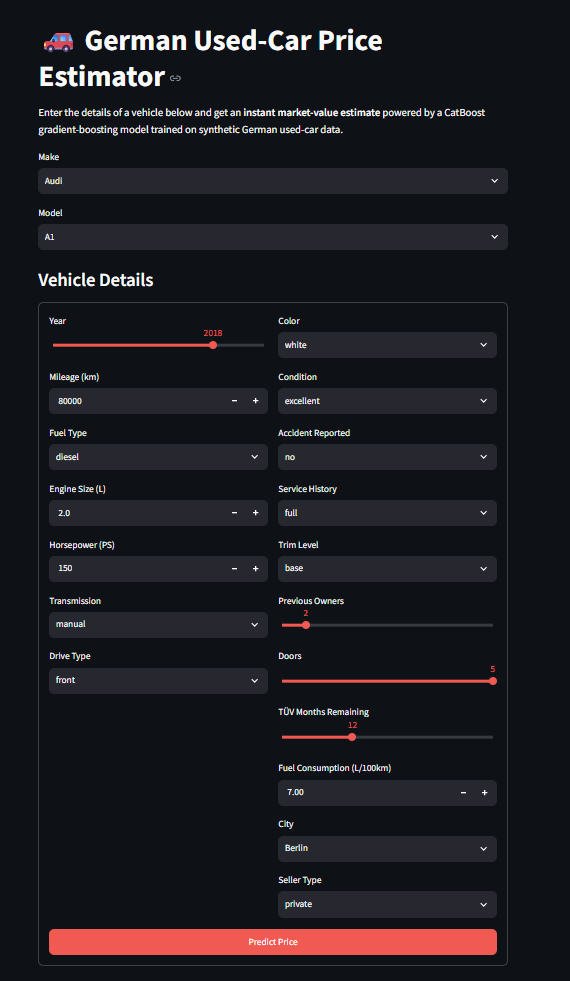
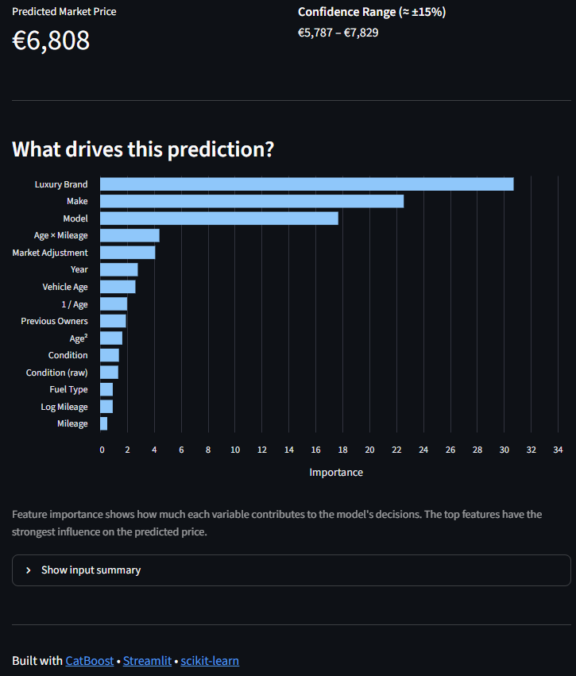

# German Used-Car Price Estimator

Ever wondered what a used car is actually worth? This project estimates market prices for used cars in Germany using a CatBoost gradient-boosting model, trained on a synthetic dataset built to reflect realistic pricing patterns.

**[Live demo](https://carpricepredictor-9dyyqzypxilspar9ecuk49.streamlit.app/)**  plug in a car's details and get a price estimate in seconds.

<p float="left">
  
  
</p>

## What it does

Fill in the details: make, model, year, mileage, condition, fuel type, and so on and the app gives you:
- An estimated market price
- A confidence range, so you know how much to trust the number
- A breakdown of which features actually moved the prediction, so it's not a black box

## Model performance

| Metric | Value |
|--------|-------|
| MAE (Mean Absolute Error) | €1,678 |
| RMSE (Root Mean Squared Error) | €3,190 |
| R² Score | 0.981 |
| MAPE (Mean Absolute Percentage Error) | 7.65% |

## Features used

Make, model, color, condition, year, accident history, mileage, service history, fuel type, trim level, engine size, previous owners, horsepower, number of doors, transmission, TÜV (inspection) months remaining, drive type, fuel consumption, city, and seller type.

## Tech stack

- **Model:** CatBoost (gradient-boosted decision trees)
- **Demo app:** Streamlit
- **Data processing:** pandas, NumPy, scikit-learn

## Running locally

```bash
git clone https://github.com/Sirius9841/CarPricePredictor.git
cd CarPricePredictor
python -m venv .venv
.venv\Scripts\Activate.ps1   # Windows
# source .venv/bin/activate  # macOS/Linux

pip install -r requirements.txt
streamlit run app.py
```

## Training the model

Want to regenerate the data or retrain the model yourself? From the project root, with the virtual environment active:

```bash
.venv\Scripts\Activate.ps1
python -m src.data_generator --samples 10000 --output data/car_data.csv
python -m src.train
python -m src.predict
```

The `--samples` and `--output` flags on `data_generator` are optional. They default to 10,000 and `data/car_data.csv` if omitted. `src.predict` is a separate interactive command-line tool that prompts you for a car's details in the terminal, it's not required to run the Streamlit app, which uses the saved model directly.

Note: because training involves some randomness, metrics will vary slightly between runs — the numbers below are from one representative run, not a fixed guarantee.

## Project structure

```
├── app.py                  # Streamlit demo app
├── requirements.txt        # Python dependencies
├── models/
│   ├── catboost_model.cbm  # Trained CatBoost model
│   ├── preprocessor.pkl    # Data preprocessing pipeline
│   └── feature_engineer.pkl
└── data/
    └── car_data.csv        # Training dataset (synthetic German used-car data)
```

## About the data

Real used-car listing data is hard to come by in bulk and often messy or inconsistent, so this model was trained on a synthetic dataset built to mirror realistic German market pricing, factoring in vehicle age, mileage, brand, condition, and other real drivers of price.

## About this project

This started as a way to work through a full machine learning pipeline end to end, not just training a model in a notebook, but actually shipping something usable: data generation, feature engineering, evaluation, and a live app someone can interact with.
